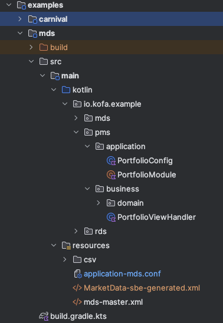

# KOFA(Kotlin for All)
KOFA is a pure kotlin library to make life much easier to build fast event driven applications, 
it is built on foundation concepts such as reactive & meta programing, with the help of compiler plugin to generate code stubs, 
it makes possible to 100% separate business logic from the library.

# Architecture Concern
KOFA believe an application should break into at least 3 main modules 
- **Application** - the config and dependencies that declared in order to accomplish a business task
- **Business** - the business domain logic that consume domain event to perform actual work.
- **Platform** - runtime library that provides business neutral features such as config parsing, component discovery, lifecycle management, error handing, memory & thread management,
  event encoding/decoding & dispatching, replay & back-testing, latency optimization etc.

# Project Structure

# Usage & Example
goto `examples` module to explore the usage, take carnival for example, in order to react on Banana/Apple events, it just takes 3 steps at compile time
1. write the domain message definition (in xml or kotlin dsl)
2. write the event handlers
3. segregate the handlers into components which can be deployed individually at runtime.

at runtime, you need a configuration file to bring up the application.
simply run `./gradlew examples:carnival:run --args='-c application-carnival.conf'`

# Inspiration & Tutorial
here is a chinese feishu doc [领略kotlin之美，手把手带你搭建一个牛逼轰轰的业务框架](https://pv2sgxx0xup.feishu.cn/docx/LqLgdaNoeoNkhexMMjkcgJX1n4g?from=from_copylink) used to explain the idea